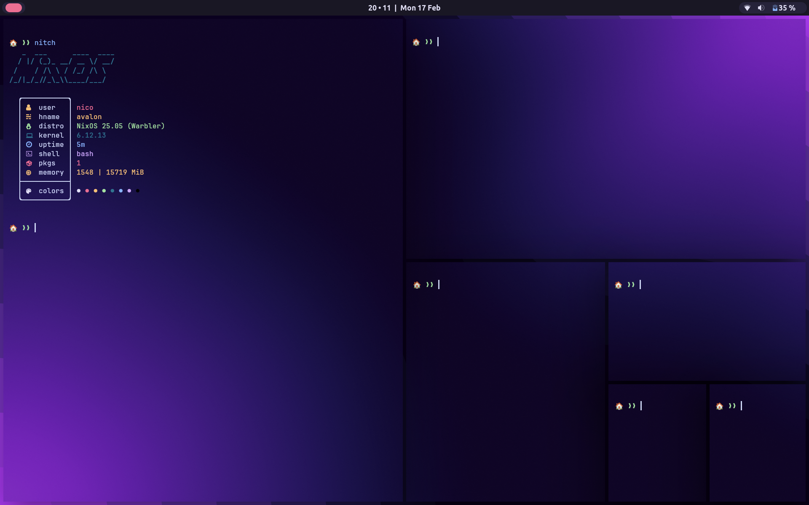

# Nix-config

## Review TODO
- [ ] Starship
- [ ] gtk / qt
- [ ] xdg
- [ ] neovim conf
- [ ] Steam
- [ ] Discord
- [ ] firefox
- [ ] other apps
- [ ] Spotify
- [ ] Hyprland
- [ ] Custom shell
- [ ] Templates

*for your viewing pleasure*

*Old config*

